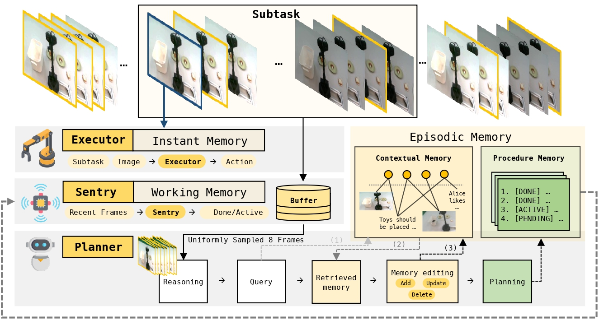
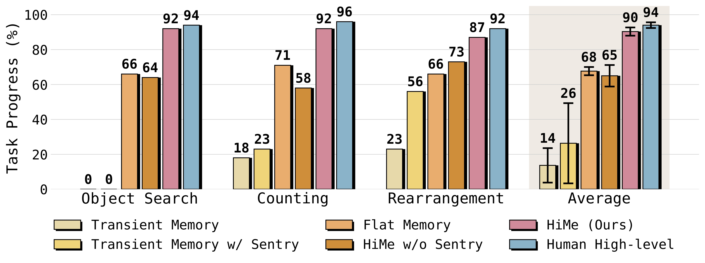

<div align="center">

# HiMe
<div>
   🧠 Hierarchical Embodied Memory for Long-Horizon Vision-Language-Action Control 🚀
</div>
</div>

<!-- <div>
<br>

<div align="center">

[**📖Paper**](<PAPER_URL>) |
[**🌐Project Page**](<PROJECT_PAGE_URL>) |

</div>
</div> -->

<strong>HiMe</strong> is a hierarchical embodied memory framework for long-horizon vision-language-action control. It is designed for robotic tasks that depend on current observations, task progress, historical context, and evolving user instructions.

---

## Overview

Long-horizon manipulation requires robots to remember past observations, track progress across subtasks, and update internal beliefs as the environment changes. Reactive policies are effective for immediate control, but often fail when task-relevant information is no longer visible.

HiMe addresses this challenge by separating fast execution from slow reasoning. The <strong>Executor</strong> performs real-time control, the <strong>Sentry</strong> monitors recent observations and determines when replanning is needed, and the <strong>Planner</strong> maintains high-level strategy and task-relevant memory.

To support long-horizon adaptation, HiMe maintains a cross-modal memory with explicit <strong>Add</strong>, <strong>Update</strong>, and <strong>Delete</strong> operations. This allows the system to preserve useful context, revise outdated beliefs, and incorporate new user preferences over time.

<p align="center">
  
</p>

---

## Main Results

HiMe achieves strong performance on three long-horizon manipulation tasks, object search, counting, and rearrangement, and consistently outperforms transient or flat memory baselines.

<p align="center">
  
</p>

<p align="center">
  <em>Main results on three long-horizon manipulation tasks.</em>
</p>

## 🚀 Installation

HiMe requires:

- Python 3.13+
- `uv` (recommended) or `pip`

Using `uv` (recommended):

```bash
uv venv
uv sync
```

If needed, you may also install dependencies with `pip` based on your local environment setup.

---

## 🛠️ Environment Configuration

### 1. Create your environment file

```bash
cp env.example.sh env.sh
```

### 2. Edit `env.sh`

Please configure the following fields according to your setup:

- planner endpoint
- observer endpoint
- embedding endpoint
- API keys
- model names
- prompt file names via `PLANNER_PROMPT_NAME` and `OBSERVER_PROMPT_NAME`
- optional runtime knobs for experiments and ablations

### 3. Load the environment

```bash
source ./env.sh
```

---

## 🧩 Prompts

Prompt definitions and output formats are documented in:

```bash
prompt/README.md
```

You can switch prompt variants through the corresponding environment variables in `env.sh`.

---

## 🤖 Client Integration

We provide reference clients in:

- `widow/infer.py`
- `flat_memory/flat_memory_client.py`

These files are intended as starting points for your own robot policy code. You should adapt them to match your actual deployment setup, including:

- camera drivers
- policy interface
- control loop
- robot-specific execution details

Please keep the task server API calls, inputs, and outputs consistent, while replacing the robot-specific components with your own implementation.

For a detailed, step-by-step client walkthrough (inputs, outputs, and integration points),
see the dedicated client guide in:

```bash
widow/README.md
```

---

## 📡 Task Server API

The client communicates with the task server through the following APIs.

### `POST /tasks`

Form fields:

- `global_instruction`
- `observer_window_size`
- `human_intervene_for_planner`
- `planner_execution_mode`

Files:

- `initial_image`
- `initial_waist_image`

Response:

- `TaskPublicState` with fields:
  - `task_id`
  - `is_done`
  - `runtime_state`
  - `planner_status`
  - `plan_list`
  - `summary`
  - `current_subtask_description`

### `POST /tasks/{task_id}/step`

Files:

- `image[]` for the main camera sequence
- `waist_image[]` for the waist camera sequence

Response:

- `TaskPublicState`

### `POST /tasks/{task_id}/user_instruction`

JSON body:

```json
{
  "user_new_instruction": "<text>"
}
```

Response:

- `TaskPublicState`

---

## 🕹️ Quick Start

### Run the task server

```bash
uv run uvicorn server.app:app --host 0.0.0.0 --port <PORT>
```

### Run the inference client (Widow)

```bash
uv run python widow/infer.py \
  --task_server_base_url <TASK_SERVER_BASE_URL> \
  --policy_host <POLICY_HOST> \
  --policy_port <POLICY_PORT> \
  --policy_trace_npz_folder ./_policy_traces
```

---

## 🧪 Optional: Flat Memory Service

If you use the Flat Memory service, start it separately:

```bash
uv run uvicorn flat_memory.app:app --host 0.0.0.0 --port <PORT>
```

Please configure the corresponding `FLAT_MEMORY_*` variables in `env.sh`.

---

## 📘 Notes

- The provided robot clients are reference implementations and may require adaptation for real-world deployment.
- For prompt design, output formatting, and configurable ablations, refer to `prompt/README.md` and `env.example.sh`.

---
